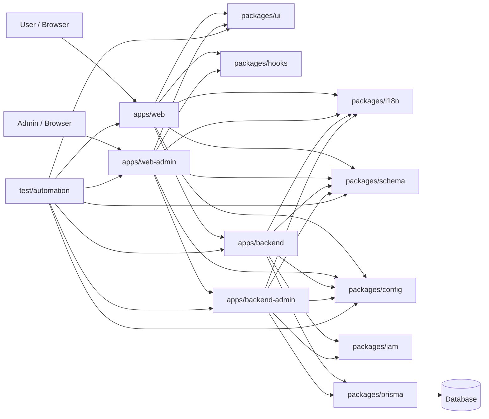

# TETAP Agent Template

TETAP Agent Template 是一个面向 AI-assisted / Vibe Coding 的全栈 monorepo 模板。它把前端、后端、配置、UI、i18n、schema、hooks、Prisma 和自动化测试拆成清晰的 workspace，目标是在快速迭代时仍然保留强约束、可测试和可演进的架构边界。

## 核心目标

- **薄应用层**：`apps/*` 只负责 runtime、路由和 feature composition。
- **强共享包**：跨切面能力统一放在 `packages/*`，避免 app-local 分叉实现。
- **契约优先**：前后端交互先定义 `@tetap/schema`，再实现业务代码。
- **文案优先**：用户可见文案先进入 `@tetap/i18n`，再被 UI/API 消费。
- **质量内建**：lint、type-check、架构检查、单元测试、Browser Mode UI 测试和冒烟测试都接入脚本。
- **代理友好**：规则集中在 `AGENTS.md`、README、逻辑架构文档和记忆文档中。

## 文档地图

| 文档                                                                                                                             | 用途                                            |
| -------------------------------------------------------------------------------------------------------------------------------- | ----------------------------------------------- |
| [AGENTS.md](AGENTS.md)                                                                                                           | 代理执行规则索引、约束入口和常用验证流程。      |
| [docs/Logical Architecture Diagram/README.md](docs/Logical%20Architecture%20Diagram/README.md)                                   | 逻辑架构总览、模块设计文档入口。                |
| [docs/Logical Architecture Diagram/00-system-overview.md](docs/Logical%20Architecture%20Diagram/00-system-overview.md)           | 系统运行流、设计原则和主要场景。                |
| [docs/Logical Architecture Diagram/01-workspace-boundaries.md](docs/Logical%20Architecture%20Diagram/01-workspace-boundaries.md) | workspace 边界、依赖方向和禁止事项。            |
| [docs/Logical Architecture Diagram/02-quality-gates.md](docs/Logical%20Architecture%20Diagram/02-quality-gates.md)               | 质量门禁、测试策略、构建和交付规则。            |
| [docs/memory/plan-workflow.md](docs/memory/plan-workflow.md)                                                                     | 多步骤计划必须同步 todolist 的长期记忆。        |
| [docs/memory/testing-workflow.md](docs/memory/testing-workflow.md)                                                               | 功能实现后的单元、Browser、冒烟和定向测试记忆。 |
| [docs/todolists](docs/todolists)                                                                                                 | 每个计划任务的 checkbox 执行记录。              |

## 快速开始

```sh
pnpm install
pnpm dev
```

常用开发命令：

```sh
pnpm check
pnpm lint
pnpm format
pnpm test:affected
pnpm test:browser
pnpm test:smoke
```

生产构建请使用根命令：

```sh
pnpm build
```

> `pnpm build` 会先运行 `pnpm check`，再执行版本 bump，然后通过 Turbo 构建所有 workspace。生产构建前应先提交功能代码，避免把版本 bump 混入功能提交。

## Workspace 总览

| Workspace            | 类型    | 职责                                                          | 设计文档                                                                             |
| -------------------- | ------- | ------------------------------------------------------------- | ------------------------------------------------------------------------------------ |
| `apps/web`           | App     | React + Vite 浏览器 runtime、React Router、页面组合。         | [apps-web.md](docs/Logical%20Architecture%20Diagram/apps-web.md)                     |
| `apps/web-admin`     | App     | 后台管理专用 React + Vite runtime 和 admin pages。            | [apps-web-admin.md](docs/Logical%20Architecture%20Diagram/apps-web-admin.md)         |
| `apps/backend`       | App     | 公共 Fastify runtime、plugins、route registration、services。 | [apps-backend.md](docs/Logical%20Architecture%20Diagram/apps-backend.md)             |
| `apps/backend-admin` | App     | 后台管理专用 Fastify runtime 和 admin APIs。                  | [apps-backend-admin.md](docs/Logical%20Architecture%20Diagram/apps-backend-admin.md) |
| `packages/config`    | Package | env 文件位置、typed env、Node/Vite 配置入口。                 | [packages-config.md](docs/Logical%20Architecture%20Diagram/packages-config.md)       |
| `packages/hooks`     | Package | React hooks 和表单 helper 集中仓库。                          | [packages-hooks.md](docs/Logical%20Architecture%20Diagram/packages-hooks.md)         |
| `packages/i18n`      | Package | locale 资源、翻译核心、React/Node helper。                    | [packages-i18n.md](docs/Logical%20Architecture%20Diagram/packages-i18n.md)           |
| `packages/iam`       | Package | IAM 权限、会话、策略、字段、数据和审计核心。                  | [packages-iam.md](docs/Logical%20Architecture%20Diagram/packages-iam.md)             |
| `packages/prisma`    | Package | Prisma schema 拆分、校验、生成和 DB 命令。                    | [packages-prisma.md](docs/Logical%20Architecture%20Diagram/packages-prisma.md)       |
| `packages/schema`    | Package | Zod request/response/entity/form 契约。                       | [packages-schema.md](docs/Logical%20Architecture%20Diagram/packages-schema.md)       |
| `packages/ui`        | Package | shadcn/ui 组件库和设计系统运行时样式。                        | [packages-ui.md](docs/Logical%20Architecture%20Diagram/packages-ui.md)               |
| `test/automation`    | Test    | Vitest 单元、Browser Mode UI、冒烟、定向测试。                | [test-automation.md](docs/Logical%20Architecture%20Diagram/test-automation.md)       |

## 逻辑架构



关键依赖方向：

- `apps/*` 可以消费 `packages/*`。
- `packages/*` 不能依赖 `apps/*`。
- `test/automation` 可以引用 apps 和 packages，用于验证 runtime 与契约。
- 根目录脚本、Turbo、ESLint、Prettier 和版本约束负责统一质量门禁。

## 脚本索引

| 命令                                    | 说明                                                                          |
| --------------------------------------- | ----------------------------------------------------------------------------- |
| `pnpm dev`                              | 通过 Turbo 启动开发任务。                                                     |
| `pnpm check`                            | 版本约束、hooks 位置、i18n 边界、后端架构检查、Turbo type-check、unit tests。 |
| `pnpm build`                            | 先 `pnpm check`，再版本 bump，最后 `turbo build`。                            |
| `pnpm type-check`                       | 运行所有 workspace 的 TypeScript 检查。                                       |
| `pnpm lint` / `pnpm lint:fix`           | 运行或自动修复 ESLint，并包含版本/hooks/backend 架构检查。                    |
| `pnpm format` / `pnpm format:fix`       | 检查或格式化全仓库文件。                                                      |
| `pnpm test`                             | 运行测试包的 unit、browser、smoke。                                           |
| `pnpm test:unit`                        | 运行 Vitest 单元测试。                                                        |
| `pnpm test:browser`                     | 运行 Vitest Browser Mode UI 功能测试。                                        |
| `pnpm test:smoke`                       | 运行 runtime 冒烟测试。                                                       |
| `pnpm test:affected`                    | 按 git 变更文件推断并运行受影响测试。                                         |
| `pnpm test:target -- <type> <target>`   | 按测试类型和模块运行定向测试。                                                |
| `pnpm versions:check`                   | 检查 React、TypeScript、Zod 等根版本约束。                                    |
| `pnpm hooks:check`                      | 检查 custom hooks 是否只在 `packages/hooks/src/store`。                       |
| `pnpm i18n:boundaries:check`            | 检查 web/admin/backend 只能导入允许的 i18n scope。                            |
| `pnpm backend:architecture:check`       | 检查 Fastify routes 是否保持 registration-only。                              |
| `pnpm db:generate` / `pnpm db:validate` | 生成或校验 Prisma Client 与 schema。                                          |
| `pnpm db:push` / `pnpm db:studio`       | 推送数据库 schema 或打开 Prisma Studio。                                      |
| `pnpm clean`                            | 清理构建缓存和产物。                                                          |

## 开发工作流

### 新增前端页面

1. 在 `packages/i18n/src/locales/zh-CN.ts` 添加用户可见文案，并同步其他 locale key。
2. 公共页面在 `apps/web` 增加路由或页面组合；后台管理页面必须在 `apps/web-admin` 增加。
3. 从 `@tetap/ui` 组合 shadcn/ui 组件，不创建 app-local UI/CSS。
4. 从 `@tetap/hooks` 使用共享 hooks；如需新增 hook，放入 `packages/hooks/src/store`。
5. 如有表单或接口交互，先在 `@tetap/schema` 定义 Zod schema。
6. 增加或更新 `test/automation/src/browser` 下的 Browser Mode UI 测试。
7. 运行 `pnpm test:affected` 或相关 `pnpm test:browser:target -- <target>`。

### 新增后端 API

1. 在 `@tetap/schema` 定义 request、response 和必要 entity schema。
2. 在 `apps/backend/src/services` 实现公共 API 逻辑，或在 `apps/backend-admin/src/services` 实现后台管理 API 逻辑。
3. 在对应 app 的 `src/routes` 只注册 method、path、options 和 imported service handler。
4. 通过 `@tetap/i18n/node` 或响应 helper 返回本地化 message。
5. 如涉及数据库，先在 `packages/prisma/schema` 按 one-model-per-file 维护 Prisma schema。
6. 增加或更新 unit/smoke 测试和 `test/automation/SMOKE_TEST_DESIGN.md`。
7. 运行 `pnpm backend:architecture:check`、`pnpm test:smoke:target -- <target>`。

### 新增共享能力

1. 判断能力归属：配置进 `packages/config`，文案进 `packages/i18n`，契约进 `packages/schema`，UI 进 `packages/ui`，hooks 进 `packages/hooks`，数据库进 `packages/prisma`。
2. 更新该 package 的 public entrypoint、README 和逻辑架构文档。
3. 如果新增测试文件或模块影响关系，更新 `test/automation/src/support/test-selection.ts`。
4. 先跑定向测试，再跑相关 package 的 `type-check` / `lint`。

## 规则

### UI 规则

- 前端应用必须通过 `@tetap/ui` 使用共享 shadcn/ui 组件。
- 新增或更新 UI 组件必须放在 `packages/ui`，优先从 shadcn/ui MCP、shadcn CLI 或 shadcn skill 获取。
- 业务页面不要手写硬编码 `className`、业务 CSS 文件或自定义样式系统。
- 允许的 CSS 仅限框架或 shadcn/ui 生成的基础主题/运行时 CSS。

### I18n 规则

- 前后端所有用户可见文案必须通过 `@tetap/i18n` 获取。
- `apps/web` 只能使用 `@tetap/i18n/public`。
- `apps/web-admin` 只能使用 `@tetap/i18n/admin`。
- `apps/backend` 只能使用 `@tetap/i18n/backend` 输出文案。
- `apps/backend-admin` 只能使用 `@tetap/i18n/backend-admin` 输出文案。
- 新增文案先维护 `zh-CN.ts`，再保持其他 locale 文件同 key 结构。
- 使用完整句子插值，例如 `t('validation.required', { field })`，不要拼接翻译片段。
- 修改导入边界后运行 `pnpm i18n:boundaries:check`。

### Config 规则

- 所有 env 配置必须经过 `@tetap/config`。
- Vite apps 使用 `configEnvDir` from `@tetap/config/vite`。
- Node.js services 在读取 env 前调用 `loadConfigEnv` from `@tetap/config/node`。
- 不要在 `apps/*` 或其他 `packages/*` 新增本地 `.env`。

### Backend 规则

- `apps/backend/src/routes` 和 `apps/backend-admin/src/routes` 只能做路由注册。
- 所有后台管理接口必须通过 `apps/backend-admin` 实现，不放入公共 `apps/backend`。
- `pnpm backend:architecture:check` 会阻止公共 `apps/backend` 出现 admin API 文件或 `/admin` 路由。
- Route 文件禁止业务逻辑、分支判断、入参解析、响应体拼装、错误码选择、数据库访问、env 读取或 i18n 调用。
- 所有逻辑、编排、校验、错误处理决策和响应体构造必须在 services 层。
- 后端统一返回 `{ code, message, data }`。
- `backend-admin` 使用 `BACKEND_ADMIN_HOST` / `BACKEND_ADMIN_PORT` 监听后台管理服务。
- 新增 route 必须声明 schema、auth/public policy 和必要 permission metadata。

### IAM 规则

- 权限、会话、策略、字段权限、数据权限和审计核心算法统一进入 `@tetap/iam`。
- HTTP request/response contract 仍然先定义在 `@tetap/schema`。
- 持久化模型只能通过 `@tetap/prisma` 维护。
- 前端 capability 只能决定 UI 显示，后端 auth hook/policy engine 必须做最终校验。
- 字段级权限必须在后端裁剪或脱敏后再返回。
- Token 必须可失效：JWT 需要 token id、session 状态和 token version 共同校验。

### Schema 规则

- 前后端交互 schema 必须统一放在 `@tetap/schema`，并基于 Zod。
- 前端表单提交前必须使用 Zod schema 校验。
- 后端 services 必须使用 `@tetap/schema` parse/validate request，并校验 response body。
- 不要在页面、组件、route 或 service 中重复写临时 schema。

### Database 规则

- 数据库 schema 和 client 访问必须通过 `@tetap/prisma`。
- `packages/prisma/schema/schema.prisma` 只能包含 datasource/generator，不放 model。
- 每个 Prisma model 独立一个 `.prisma` 文件。
- 数据库命令使用根脚本：`pnpm db:generate`、`pnpm db:validate`、`pnpm db:push`、`pnpm db:studio`。

### Hooks 规则

- 所有 custom React hooks 必须放在 `packages/hooks/src/store`。
- 不要在 app/package 内创建本地 `hooks` 目录或本地 `use*.ts(x)`。
- 使用 hooks 时从 `@tetap/hooks`、`@tetap/hooks/store` 或 `@tetap/hooks/*` 导入。
- 新增或移动 hooks 后运行 `pnpm hooks:check`。

### Dependency 规则

- `react`、`react-dom`、`typescript` 只能由根 `package.json` 安装和控制。
- `zod`、`react-hook-form`、`@hookform/resolvers` 也由根版本和 `pnpm.overrides` 锁定。
- Workspace 如需声明 peer dependency，版本必须与根版本完全一致。
- 修改依赖后运行 `pnpm versions:check`。

### Testing 规则

- 自动化测试统一放在 `test/automation`，使用 Vitest。
- 单元测试放在 `test/automation/src/unit`。
- UI 功能测试必须使用 Vitest Browser Mode，放在 `test/automation/src/browser`。
- 冒烟测试放在 `test/automation/src/smoke`，设计记录在 `test/automation/SMOKE_TEST_DESIGN.md`。
- 开发中优先运行 `pnpm test:affected` 或 `pnpm test:target -- <type> <target>`。
- 新增模块、测试或影响关系时，必须更新 `test/automation/src/support/test-selection.ts`。
- 根 `pnpm build` 必须包含 smoke gate；冒烟不通过，build 不算成功。

### Planning 规则

- 多步骤计划必须同步 `docs/todolists` 下的 checkbox 执行计划。
- 执行前先搜索是否已有相关 todolist，避免重复。
- 计划状态变化时同步更新 todolist。
- 完成后设置 `Status: Closed`，添加关闭日期和 closure notes。

### TypeScript 门禁

- TypeScript 错误不能交付。
- 根 `pnpm check` 是最终 TypeScript gate。
- 每个 TypeScript workspace 必须保留 `type-check` 脚本。
- 不要用裸 `vite build` 代替最终类型检查。

### Release 规则

- 生产 build 前先提交功能/代码修改。
- `pnpm build` 会自动执行 `pnpm version:bump` 并统一 workspace 版本。
- build 成功后，版本 bump 需要单独提交，建议 `chore(release): vX.Y.Z`。
- 版本提交后创建同名 tag：`vX.Y.Z`。
- 不要把功能变更和版本 bump 混在一个提交中。

## 完成交付检查

修改文件后的默认收口：

```sh
pnpm lint:fix
pnpm format:fix
pnpm check
```

根据影响范围补充：

```sh
pnpm test:affected
pnpm test:browser
pnpm test:smoke
pnpm --filter @tetap/test-automation build
```

如果任务使用了计划，还必须关闭对应 `docs/todolists/*.md`。
