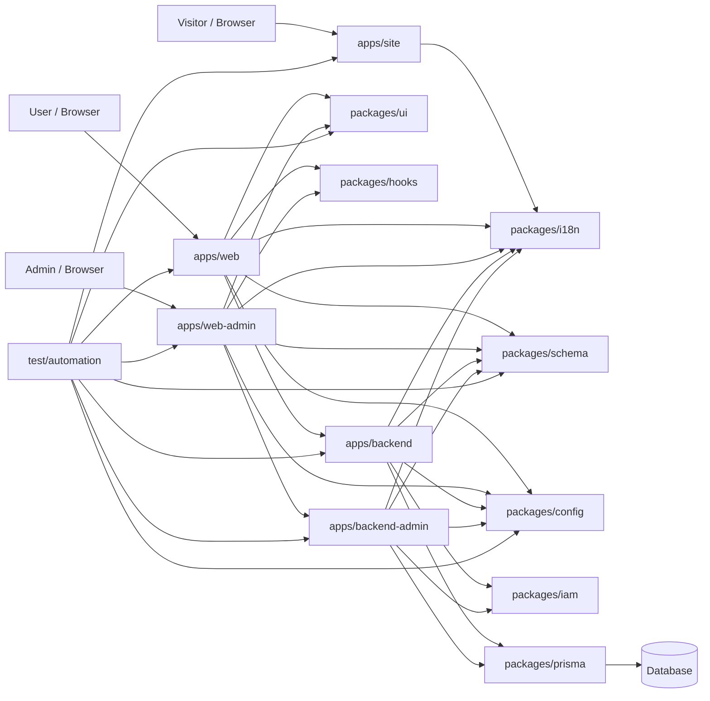

<p align="center">
  
</p>

# TETAP Agent Template

<p align="center">
  Open-source enterprise full-stack monorepo for AI-assisted development with React, Fastify, TypeScript, IAM, scoped i18n, Prisma, and automated quality gates.
</p>

<p align="center">
  <a href="README.zh-CN.md">简体中文</a> ·
  <a href="README.ko-KR.md">한국어</a> ·
  <a href="README.ja-JP.md">日本語</a>
</p>

## Overview

TETAP Agent Template is an open-source full-stack monorepo template for AI-assisted application development. It separates the VitePress site, public web, admin web, Fastify APIs, IAM, configuration, UI, i18n, schemas, Prisma, and automation tests into explicit workspaces so teams can move quickly without losing architectural control.

## Highlights

- **Enterprise IAM foundation**: JWT, RBAC, PBAC, field permissions, dynamic menus, session invalidation, forced logout, and operation logs.
- **Contract-first development**: request, response, and form contracts live in `@tetap/schema` and use Zod.
- **Scoped i18n**: site, public web, admin web, public backend, and backend-admin use isolated i18n entrypoints.
- **VitePress promotional site**: `apps/site` provides a polished technical landing page, continuous scroll story, GitHub Pages deployment, and site-scoped copy.
- **Shared UI system**: apps compose shadcn/ui components and brand assets from `@tetap/ui`.
- **Secure defaults**: Fastify security plugins, CORS allowlists, body limits, rate limits, consistent errors, and route architecture checks.
- **Automated quality gates**: TypeScript, ESLint, Prettier, architecture checks, unit tests, Browser Mode tests, and smoke tests.
- **Agent-friendly workflow**: `AGENTS.md`, architecture docs, todolist memory, and test impact mapping guide multi-step work.

## Quick Start

```sh
pnpm install
pnpm dev
```

Common commands:

```sh
pnpm check
pnpm lint
pnpm format
pnpm test:affected
pnpm test:browser
pnpm test:smoke
```

Production build:

```sh
pnpm build
```

`pnpm build` runs `pnpm check`, bumps versions, and then builds every workspace with Turbo. Commit feature code before production builds so release version bumps stay in a separate commit.

## Workspaces

| Workspace            | Type    | Responsibility                                                         | Design Doc                                                                           |
| -------------------- | ------- | ---------------------------------------------------------------------- | ------------------------------------------------------------------------------------ |
| `apps/site`          | App     | VitePress promotional/docs site runtime and static page composition.   | [apps-site.md](docs/Logical%20Architecture%20Diagram/apps-site.md)                   |
| `apps/web`           | App     | Public React + Vite runtime, routing, and page composition.            | [apps-web.md](docs/Logical%20Architecture%20Diagram/apps-web.md)                     |
| `apps/web-admin`     | App     | Admin React + Vite runtime and admin pages.                            | [apps-web-admin.md](docs/Logical%20Architecture%20Diagram/apps-web-admin.md)         |
| `apps/backend`       | App     | Public Fastify runtime, plugins, route registration, services.         | [apps-backend.md](docs/Logical%20Architecture%20Diagram/apps-backend.md)             |
| `apps/backend-admin` | App     | Admin Fastify runtime and admin APIs.                                  | [apps-backend-admin.md](docs/Logical%20Architecture%20Diagram/apps-backend-admin.md) |
| `packages/config`    | Package | Env file location, typed env, Node/Vite config entrypoints.            | [packages-config.md](docs/Logical%20Architecture%20Diagram/packages-config.md)       |
| `packages/hooks`     | Package | Shared React hooks and form helpers.                                   | [packages-hooks.md](docs/Logical%20Architecture%20Diagram/packages-hooks.md)         |
| `packages/i18n`      | Package | Locale resources, translation core, site/React/Node helpers.           | [packages-i18n.md](docs/Logical%20Architecture%20Diagram/packages-i18n.md)           |
| `packages/iam`       | Package | IAM permissions, sessions, policies, fields, data, and operation logs. | [packages-iam.md](docs/Logical%20Architecture%20Diagram/packages-iam.md)             |
| `packages/prisma`    | Package | Prisma schema splitting, validation, generation, and DB scripts.       | [packages-prisma.md](docs/Logical%20Architecture%20Diagram/packages-prisma.md)       |
| `packages/schema`    | Package | Zod request/response/entity/form contracts.                            | [packages-schema.md](docs/Logical%20Architecture%20Diagram/packages-schema.md)       |
| `packages/ui`        | Package | shadcn/ui components, design-system styles, and brand SVG.             | [packages-ui.md](docs/Logical%20Architecture%20Diagram/packages-ui.md)               |
| `test/automation`    | Test    | Vitest unit, Browser Mode UI, smoke, and targeted tests.               | [test-automation.md](docs/Logical%20Architecture%20Diagram/test-automation.md)       |

## Architecture



## Documentation

| Document                                                                                                                         | Purpose                                                                                |
| -------------------------------------------------------------------------------------------------------------------------------- | -------------------------------------------------------------------------------------- |
| [AGENTS.md](AGENTS.md)                                                                                                           | Agent operating guide, constraints, and common validation flow.                        |
| [docs/Logical Architecture Diagram/README.md](docs/Logical%20Architecture%20Diagram/README.md)                                   | Logical architecture overview and module design index.                                 |
| [docs/Logical Architecture Diagram/00-system-overview.md](docs/Logical%20Architecture%20Diagram/00-system-overview.md)           | Runtime flow, design principles, and key scenarios.                                    |
| [docs/Logical Architecture Diagram/01-workspace-boundaries.md](docs/Logical%20Architecture%20Diagram/01-workspace-boundaries.md) | Workspace boundaries, dependency direction, and forbidden edges.                       |
| [docs/Logical Architecture Diagram/02-quality-gates.md](docs/Logical%20Architecture%20Diagram/02-quality-gates.md)               | Quality gates, test strategy, build, and delivery rules.                               |
| [docs/Logical Architecture Diagram/apps-site.md](docs/Logical%20Architecture%20Diagram/apps-site.md)                             | VitePress promotional site architecture and boundaries.                                |
| [docs/memory/plan-workflow.md](docs/memory/plan-workflow.md)                                                                     | Long-term memory for syncing multi-step plans to todolists.                            |
| [docs/memory/readme-sync-workflow.md](docs/memory/readme-sync-workflow.md)                                                       | Long-term memory for keeping README and architecture docs accurate after code changes. |
| [docs/memory/testing-workflow.md](docs/memory/testing-workflow.md)                                                               | Unit, Browser, smoke, and targeted testing memory.                                     |
| [docs/todolists](docs/todolists)                                                                                                 | Checkbox execution records for planned tasks.                                          |

## Scripts

| Command                                 | Description                                                                 |
| --------------------------------------- | --------------------------------------------------------------------------- |
| `pnpm dev`                              | Start development tasks through Turbo.                                      |
| `pnpm check`                            | Run version, hooks, i18n, backend architecture, type-check, and unit tests. |
| `pnpm build`                            | Run `pnpm check`, bump versions, then build all workspaces with Turbo.      |
| `pnpm type-check`                       | Run TypeScript checks for every workspace.                                  |
| `pnpm --filter site dev`                | Start the VitePress promotional site.                                       |
| `pnpm lint` / `pnpm lint:fix`           | Run or fix ESLint, plus version/hooks/i18n/backend architecture checks.     |
| `pnpm format` / `pnpm format:fix`       | Check or format repository files.                                           |
| `pnpm test`                             | Run unit, browser, and smoke tests.                                         |
| `pnpm test:unit`                        | Run Vitest unit tests.                                                      |
| `pnpm test:browser`                     | Run Vitest Browser Mode UI tests.                                           |
| `pnpm test:smoke`                       | Run runtime smoke tests.                                                    |
| `pnpm test:affected`                    | Infer affected tests from git changes.                                      |
| `pnpm test:target -- <type> <target>`   | Run targeted tests by type and module.                                      |
| `pnpm versions:check`                   | Check root dependency version constraints.                                  |
| `pnpm hooks:check`                      | Verify custom hooks live only in `packages/hooks/src/store`.                |
| `pnpm i18n:boundaries:check`            | Verify each app imports only its allowed i18n scope.                        |
| `pnpm backend:architecture:check`       | Verify Fastify routes remain registration-only.                             |
| `pnpm db:generate` / `pnpm db:validate` | Generate or validate Prisma Client and schema.                              |
| `pnpm db:push` / `pnpm db:studio`       | Push database schema or open Prisma Studio.                                 |
| `pnpm clean`                            | Clean build caches and outputs.                                             |

## Contributing

- Use issues for bugs, improvements, security risks, and documentation problems.
- Keep pull requests focused and include validation commands in the PR description.
- Do not post secrets, tokens, database connection strings, or exploit details in public issues.
- Read [AGENTS.md](AGENTS.md) and the [architecture docs](docs/Logical%20Architecture%20Diagram/README.md) before large changes.

## Rules

### UI Rules

- Frontend apps must use shared shadcn/ui components and brand assets through `@tetap/ui`.
- New or updated UI primitives belong in `packages/ui`.
- Apps must not create app-local UI systems, `components/ui`, or feature-level CSS frameworks.
- Only framework, VitePress theme runtime, or shadcn/ui generated base theme/runtime CSS is allowed.

### I18n Rules

- All site, frontend, and backend user-visible copy must come from `@tetap/i18n`.
- `apps/site` may only use `@tetap/i18n/site`.
- `apps/web` may only use `@tetap/i18n/public`.
- `apps/web-admin` may only use `@tetap/i18n/admin`.
- `apps/backend` may only use `@tetap/i18n/backend` for response copy.
- `apps/backend-admin` may only use `@tetap/i18n/backend-admin` for response copy.
- Add keys to `zh-CN.ts` first, then keep other locale files in the same key shape.
- Use complete-sentence interpolation such as `t('validation.required', { field })`; do not concatenate translation fragments.
- Run `pnpm i18n:boundaries:check` after import boundary changes.

### Config Rules

- All env configuration must go through `@tetap/config`.
- Vite apps must use `configEnvDir` from `@tetap/config/vite`.
- Node services must call `loadConfigEnv` from `@tetap/config/node` before reading env.
- Do not add app-local `.env` files under `apps/*` or other packages.

### Backend Rules

- `apps/backend/src/routes` and `apps/backend-admin/src/routes` must only register routes.
- Admin APIs must live in `apps/backend-admin`, never in public `apps/backend`.
- Route files must not contain business logic, branching, request parsing, response composition, error-code decisions, database access, env reads, or i18n calls.
- Services own logic, orchestration, validation, error decisions, and response-body construction.
- Backend responses use `{ code, message, data }`.
- New routes must declare schema, auth/public policy, and required permission metadata.

### IAM Rules

- Permission, session, policy, field permission, data permission, and operation-log algorithms live in `@tetap/iam`.
- HTTP request/response contracts still start in `@tetap/schema`.
- Persistence models are maintained only through `@tetap/prisma`.
- Frontend capabilities only control UI visibility; backend auth hooks and policy engine make final decisions.
- Field-level permissions must be trimmed or masked on the backend before data reaches clients.
- Tokens must be revocable: JWT requires token id, session state, and token version checks.

### Schema Rules

- Frontend/backend contracts live in `@tetap/schema` and use Zod.
- Frontend forms must validate with Zod before submission.
- Backend services must parse/validate requests and validate response bodies with `@tetap/schema`.
- Do not duplicate temporary schemas in pages, components, routes, or services.

### Database Rules

- Database schema and client access must go through `@tetap/prisma`.
- `packages/prisma/schema/schema.prisma` contains only datasource/generator blocks, not models.
- Each Prisma model lives in one dedicated `.prisma` file.
- Database commands use root scripts: `pnpm db:generate`, `pnpm db:validate`, `pnpm db:push`, and `pnpm db:studio`.

### Hooks Rules

- All custom React hooks must live in `packages/hooks/src/store`.
- Do not create app/package local `hooks` directories or local `use*.ts(x)` hooks.
- Import hooks from `@tetap/hooks`, `@tetap/hooks/store`, or `@tetap/hooks/*`.
- Run `pnpm hooks:check` after adding or moving hooks.

### Dependency Rules

- `react`, `react-dom`, `typescript`, `zod`, `react-hook-form`, and `@hookform/resolvers` versions are controlled at the root.
- Workspace peer dependencies must exactly match root versions when declared.
- Run `pnpm versions:check` after dependency changes.

### Testing Rules

- Automated tests live in `test/automation` and use Vitest.
- Unit tests live in `test/automation/src/unit`.
- UI behavior tests use Vitest Browser Mode and live in `test/automation/src/browser`.
- Smoke tests live in `test/automation/src/smoke`; designs are recorded in `test/automation/SMOKE_TEST_DESIGN.md`.
- Prefer `pnpm test:affected` or relevant `pnpm test:*:target` commands during development.
- Update `test/automation/src/support/test-selection.ts` when modules, tests, or impact relationships change.

### Planning Rules

- Multi-step plans must sync a checkbox plan under `docs/todolists`.
- Search for existing related todolists before creating a new one.
- Update todolist status as the plan changes.
- Close the todolist with closure date and validation notes when complete.

### Documentation Rules

- Code, export, API, schema, Prisma model, script, or behavior changes must update the nearest app/package README.
- Repository-wide changes must also update root README, localized README files, AGENTS, and the relevant architecture docs.
- Package READMEs must accurately list current public entrypoints, tools, helper methods, scripts, and validation commands.
- Before handoff, compare package READMEs against `package.json#exports`, `src/index.ts`, route lists, Prisma model files, and important service/store methods.
- Follow [README Sync Memory](docs/memory/readme-sync-workflow.md) before handoff.

### TypeScript Gate

- Do not deliver TypeScript errors.
- Final validation should pass `pnpm check`, or a narrower relevant workspace `type-check` when the scope is explicit.
- Do not use `any` or type assertions to bypass contract problems; fix schemas, types, or call boundaries.

### Release Rules

- Production builds bump versions centrally.
- Version bumps must be separate commits and tags.
- Before release, confirm `pnpm check`, `pnpm test:smoke`, and required Browser Mode tests pass.

## License

This project is released under the [MIT License](LICENSE).
