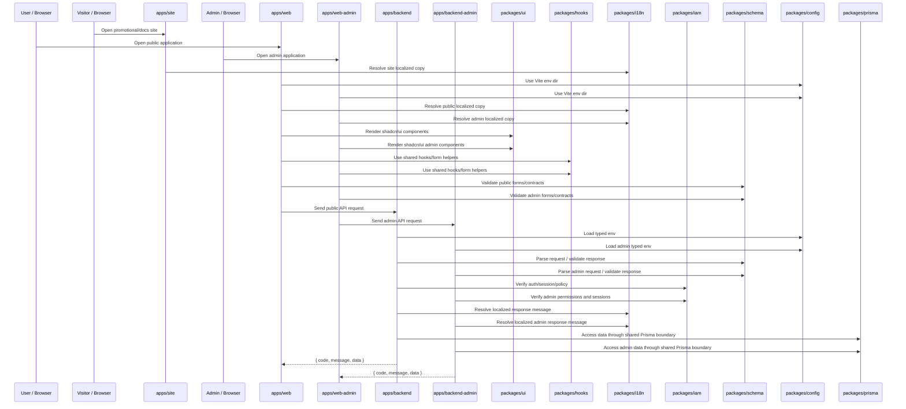

# System Overview

## 定位

TETAP Agent Template 是一个面向 AI-assisted / Vibe Coding 的全栈 starter。它通过清晰 workspace 边界把快速迭代中最容易失控的能力集中管理：配置、UI、文案、契约、hooks、数据库、VitePress 宣传站、公共 Web、后台管理 Web、公共 API、后台管理 API 和测试。

## 设计目标

| 目标                    | 说明                                                                                                                                        |
| ----------------------- | ------------------------------------------------------------------------------------------------------------------------------------------- |
| Thin Apps               | apps 只保留 runtime、路由、页面组合和业务入口，不沉淀跨切面能力。                                                                           |
| Public/Admin/Site Split | 宣传/文档站属于 `apps/site`，公共页面/API 属于 `apps/web` + `apps/backend`，后台管理页面/API 属于 `apps/web-admin` + `apps/backend-admin`。 |
| Shared Capabilities     | 配置、UI、i18n、schema、hooks、IAM、Prisma 由 packages 统一提供。                                                                           |
| Schema-first            | 前后端交互和统一响应体先在 `@tetap/schema` 建模。                                                                                           |
| Locale-first            | 用户可见文案先进入 `@tetap/i18n`，再被 UI/API 引用。                                                                                        |
| Route-light Backend     | Fastify routes 只注册；所有逻辑进入 services。                                                                                              |
| Test-aware Development  | 每次功能变更都考虑 unit、Browser Mode UI、smoke 和 affected test mapping。                                                                  |

## 运行时交互

## 关键边界

- `apps/site` 是 VitePress 宣传/文档站，只承载静态站点 runtime、theme 和页面组合，文案使用 `@tetap/i18n/site`。
- `apps/web` 不拥有 UI 库、hooks、i18n 资源、schema 定义或 env 策略，也不承载后台管理页面。
- `apps/web-admin` 是后台管理页面唯一浏览器入口，不拥有 UI 库、hooks、i18n 资源、schema 定义或 env 策略。
- `apps/backend` 不拥有 schema package、Prisma schema，也不允许在 routes 写业务逻辑。
- `apps/backend-admin` 是后台管理接口唯一服务端入口，公共 backend 不承载 admin APIs。
- `packages/iam` 拥有权限、会话、策略、字段、数据和操作日志核心算法，apps 只编排调用。
- `packages/*` 不依赖 `apps/*`，避免共享包反向绑定具体 runtime。
- `test/automation` 是唯一允许同时验证 apps 和 packages 的集中测试 workspace。

## 典型扩展路径

| 场景           | 推荐路径                                                                                                        |
| -------------- | --------------------------------------------------------------------------------------------------------------- |
| 新宣传/文档页  | i18n 文案 → `apps/site` markdown/theme component → VitePress build → targeted unit/build 验证。                 |
| 新页面         | i18n 文案 → `apps/web` route/page → `@tetap/ui` 组件组合 → Browser Mode 测试。                                  |
| 新后台管理页面 | i18n 文案 → `apps/web-admin` route/page → `@tetap/ui` 组件组合 → `backend-admin` contract → Browser Mode 测试。 |
| 新公共 API     | `@tetap/schema` contract → `apps/backend` service → thin route registration → smoke/unit tests。                |
| 新后台管理 API | `@tetap/schema` contract → `apps/backend-admin` service → thin route registration → admin smoke tests。         |
| 新权限能力     | `@tetap/iam` engine → `@tetap/schema` contract → `backend-admin` hook/service → unit/smoke/browser tests。      |
| 新共享 UI      | shadcn/ui MCP/CLI/skill → `packages/ui` → export → docs/test mapping。                                          |
| 新配置项       | `packages/config/env` 模板 → typed parser → Node/Vite helper 消费。                                             |
| 新数据模型     | `packages/prisma/schema/<Model>.prisma` → root db scripts → service 层使用。                                    |
| 新通用 hook    | `packages/hooks/src/store` → export → `pnpm hooks:check`。                                                      |

## 架构反模式

- 在 app 内复制 `components/ui`、`hooks`、`schema`、`i18n` 或 `.env` 策略。
- 在公共 `apps/backend` 实现后台管理接口。
- 在公共 `apps/web` 实现后台管理页面。
- 为了快速实现，把 backend route 写成 controller/service 混合体。
- 在 UI 测试中只用 jsdom 替代真实浏览器交互。
- 只跑全量测试，不维护模块影响映射，导致开发循环变慢。
- 修改架构规则但不更新 AGENTS、README 和逻辑架构文档。
