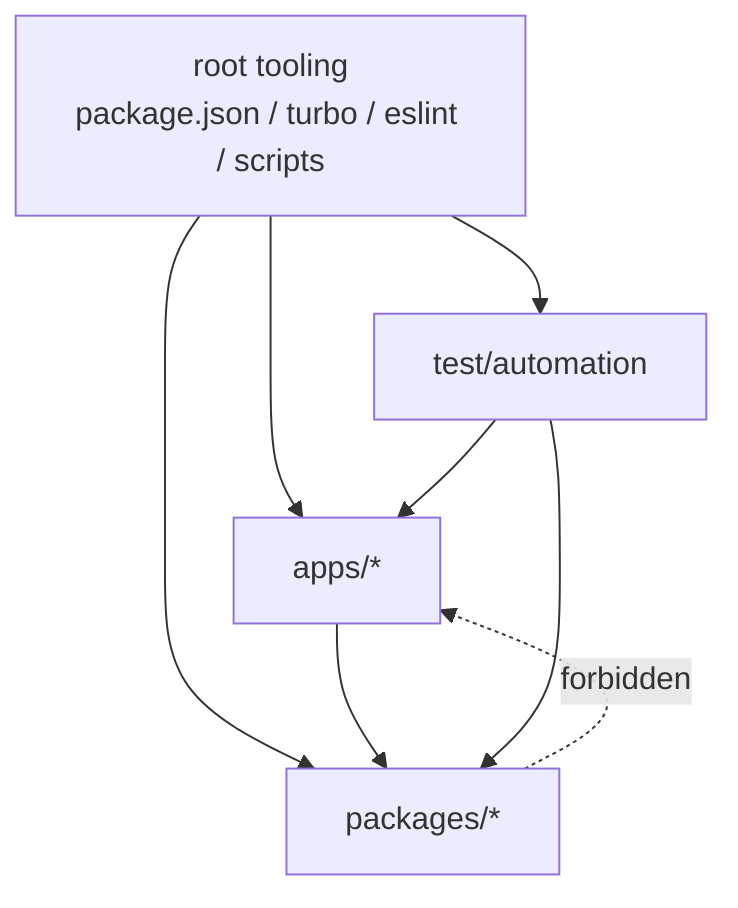
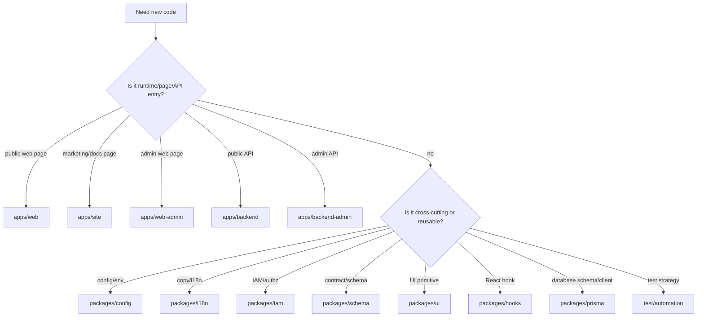

# Workspace Boundaries

## 依赖方向

## Ownership Matrix

| Workspace            | Owns                                                                                    | Must Not Own                                                                                                         |
| -------------------- | --------------------------------------------------------------------------------------- | -------------------------------------------------------------------------------------------------------------------- |
| `apps/site`          | VitePress 宣传/文档站 runtime、custom theme、静态页面组合。                             | 公共业务页面、后台管理页面、UI primitive、custom hooks、schema definitions、env policy。                             |
| `apps/web`           | React runtime、router、page composition、浏览器入口。                                   | Admin pages、UI primitive、app-local CSS system、custom hooks、locale resources、schema definitions、env policy。    |
| `apps/web-admin`     | Admin React runtime、admin router、admin page composition、浏览器管理端入口。           | Public pages、UI primitive、app-local CSS system、custom hooks、locale resources、schema definitions、env policy。   |
| `apps/backend`       | Public Fastify runtime、plugins、routes registration、services、backend helpers。       | Admin APIs、Zod contract package、Prisma schema、route-level business logic、app-local env loader。                  |
| `apps/backend-admin` | Admin Fastify runtime、admin routes registration、admin services、admin helpers。       | Public API responsibilities、Zod contract package、Prisma schema、route-level business logic、app-local env loader。 |
| `packages/config`    | env 文件目录、env parser、typed `AppEnv`、Node/Vite/Tailwind config entrypoints。       | feature-specific runtime logic、app-local secret policy。                                                            |
| `packages/hooks`     | React custom hooks、form helper、hooks barrel exports。                                 | UI components、locale resources、schema definitions、runtime pages。                                                 |
| `packages/i18n`      | locale tree、translation core、React provider、site translator、Node request helper。   | 业务流程、layout、API handler。                                                                                      |
| `packages/iam`       | IAM engines、session/token policy、RBAC/ABAC/PBAC、field/data policy、audit redaction。 | HTTP route、Prisma schema、env loading、React page。                                                                 |
| `packages/prisma`    | Prisma schema 文件、schema structure checks、client generate/validate scripts。         | HTTP contract schema、service business logic、alternate ORM。                                                        |
| `packages/schema`    | Zod request/response/entity/form contracts、统一响应 schema helper。                    | persistence、business orchestration、runtime side effects。                                                          |
| `packages/ui`        | shadcn/ui source components、design-system runtime CSS、UI exports。                    | app pages、feature copy、app-local routing、business CSS。                                                           |
| `test/automation`    | Vitest unit/browser/smoke tests、affected test selector、smoke design。                 | production runtime code、business implementation。                                                                   |

## 允许的依赖

- `apps/site` → `@tetap/i18n/site`；VitePress theme CSS 只允许留在 `apps/site/src/.vitepress/theme`。
- `apps/web` → `@tetap/ui`、`@tetap/hooks`、`@tetap/i18n/public`、`@tetap/schema`、`@tetap/config`。
- `apps/web-admin` → `@tetap/ui`、`@tetap/hooks`、`@tetap/i18n/admin`、`@tetap/schema`、`@tetap/config`；后台管理接口只对接 `apps/backend-admin`。
- `apps/backend` → `@tetap/config`、`@tetap/i18n/backend`、`@tetap/iam`、`@tetap/schema`，未来需要时通过 `@tetap/prisma` 访问 DB。
- `apps/backend-admin` → `@tetap/config`、`@tetap/i18n/backend-admin`、`@tetap/iam`、`@tetap/schema`，未来需要时通过 `@tetap/prisma` 访问 DB。
- `packages/hooks` → scoped `@tetap/i18n/*` React providers，并通过 peer dependency 使用 React/RHF/Zod。
- `packages/ui` → Radix/CVA/clsx/tailwind-merge，并通过 peer dependency 使用 React。
- `test/automation` → apps 和 packages，用于验证运行链路和契约。

## 禁止的依赖

- `packages/*` 不要 import `apps/*`。
- `apps/*` 不要复制 `packages/*` 已拥有的能力。
- `apps/site` 不要承载公共业务页面、后台管理页面、后端逻辑或跨 app 复用 UI primitive。
- `apps/backend/src/routes` 和 `apps/backend-admin/src/routes` 不要 import config/i18n/schema/prisma 进行逻辑处理；这些属于 services 或 plugins。
- 后台管理接口不要放进公共 `apps/backend`；必须放进 `apps/backend-admin`。
- `apps/web` 和 `apps/web-admin` 不要新增 app-local `components/ui`、`hooks`、`styles`、`lib` 或 `components.json`。
- `apps/site`、`apps/web`、`apps/web-admin`、`apps/backend`、`apps/backend-admin` 不要导入不属于自己的 i18n scope。
- apps 不要复制 IAM 权限算法；复用 `@tetap/iam`。
- 任何 workspace 不要安装根目录统一控制的 React、TypeScript、Zod、RHF、resolver 版本。

## 新增模块决策树

## 扩展检查清单

- 是否有现有 package 已经拥有这个职责？
- 如果是后台管理接口，是否明确放在 `apps/backend-admin`？
- 如果是后台管理页面，是否明确放在 `apps/web-admin`？
- 是否需要新增 public export？如果需要，是否同步 package README 和架构文档？
- 是否影响 testing impact map？如果影响，更新 `test/automation/src/support/test-selection.ts`。
- 是否影响 root scripts、Turbo task 或质量门禁？如果影响，更新 `02-quality-gates.md`。
