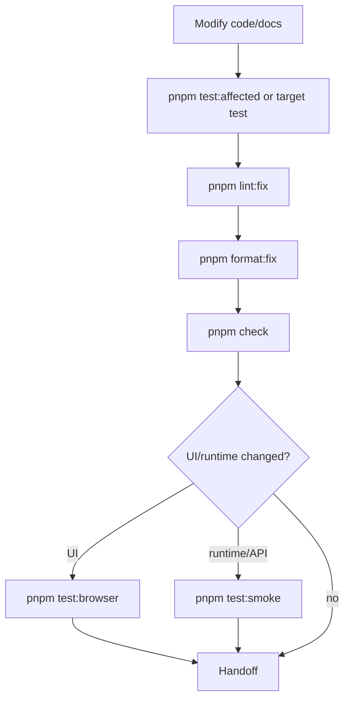

# Quality Gates

## 质量门禁目标

质量门禁用于保证快速生成代码时不破坏 workspace 边界、类型安全、依赖版本、hooks 位置、后端分层、测试策略和发布流程。

## 根命令门禁

| Command                           | Gate                                                                                       |
| --------------------------------- | ------------------------------------------------------------------------------------------ |
| `pnpm versions:check`             | React、React DOM、TypeScript、Zod、RHF、resolver 只能由根版本控制。                        |
| `pnpm hooks:check`                | custom hooks 只能位于 `packages/hooks/src/store`。                                         |
| `pnpm i18n:boundaries:check`      | apps 只能导入允许的 scoped i18n entrypoint。                                               |
| `pnpm backend:architecture:check` | Fastify routes 必须保持 registration-only。                                                |
| `pnpm type-check`                 | Turbo 运行所有 workspace `type-check`。                                                    |
| `pnpm test:unit`                  | 运行集中单元测试。                                                                         |
| `pnpm check`                      | 串联 versions、hooks、i18n boundaries、backend architecture、type-check、unit tests。      |
| `pnpm lint`                       | 在 ESLint 前先执行 versions、hooks、i18n boundaries、backend architecture。                |
| `pnpm build`                      | 先 `pnpm check`，再 version bump，最后 `turbo build`，其中 test package build 会跑 smoke。 |

## 推荐开发验证顺序



## 定向测试策略

| Command                                                                | When                                                      |
| ---------------------------------------------------------------------- | --------------------------------------------------------- |
| `pnpm test:affected`                                                   | 开发循环默认入口，根据 git changed files 选择受影响测试。 |
| `pnpm test:unit:target -- i18n-site`                                   | 只跑 VitePress 宣传站文案 scope 的单元测试。              |
| `pnpm test:target -- unit schema-response`                             | 只跑某个 unit target。                                    |
| `pnpm test:target -- unit schema-response --name healthResponseSchema` | 按用例名过滤。                                            |
| `pnpm test:browser:target -- ui-components`                            | 只跑共享 UI Browser Mode target。                         |
| `pnpm test:browser:target -- web-admin-dashboard`                      | 只跑后台管理页面 Browser Mode target。                    |
| `pnpm test:smoke:target -- backend-admin-iam`                          | 只跑后台管理 IAM 登录、鉴权、强制下线 smoke。             |
| `pnpm test:unit:target -- iam-engine`                                  | 只跑 IAM 权限、字段、数据、审计核心单元测试。             |
| `pnpm test:smoke:target -- backend-health`                             | 只跑某个冒烟测试。                                        |

影响映射由 `test/automation/src/support/test-selection.ts` 维护。新增模块、测试文件或影响关系时必须更新它。

## 测试分层

| Layer   | Location                      | Purpose                                           | Required When                                                                                  |
| ------- | ----------------------------- | ------------------------------------------------- | ---------------------------------------------------------------------------------------------- |
| Unit    | `test/automation/src/unit`    | 验证纯逻辑、schema、helper、contract。            | 修改 package logic、schema、config、target selector。                                          |
| Browser | `test/automation/src/browser` | 使用 Vitest Browser Mode 验证真实浏览器 UI 行为。 | 修改页面、路由、UI interaction、shared UI components。                                         |
| Smoke   | `test/automation/src/smoke`   | 验证 app boot、critical API flow、统一响应体。    | 修改 backend runtime、routing、middleware、security、API contract、build/runtime integration。 |

`apps/site` 是静态 VitePress 宣传站，完成变更时至少运行 `pnpm test:unit:target -- i18n-site` 和 `pnpm --filter site build`；视觉变更还应通过浏览器预览或截图检查。

## Backend Architecture Gate

`pnpm backend:architecture:check` 会同时检查 `apps/backend` 和 `apps/backend-admin`，阻止 route 层出现逻辑。Route 文件只允许：

- HTTP method/path/options。
- 从 services 导入 handler。
- 注册 route。

禁止在 route 文件中出现 request parsing、response building、i18n、env、database、branching、error code selection 等逻辑。该 gate 同时阻止公共 `apps/backend` 出现 admin API 文件或 `/admin` 路由，所有后台管理 API 必须进入 `apps/backend-admin`。

## TypeScript Gate

- 所有 TypeScript workspace 必须提供 `type-check`。
- 根 `pnpm check` 是交付前的 TypeScript gate。
- Vite build 不能替代 type-check。
- TypeScript 6 的弃用项不通过静音掩盖；优先迁移配置，例如移除不必要的 `baseUrl`。

## Format And Lint Gate

修改文件后默认执行：

```sh
pnpm lint:fix
pnpm format:fix
```

如果自动修复修改了文件，需要重新跑相关校验。

## Build And Release Gate

生产构建流程：

1. 提交功能代码。
2. 运行 `pnpm build`。
3. build 自动执行 `pnpm version:bump`，统一 workspace 版本。
4. build 成功后单独提交版本 bump：`chore(release): vX.Y.Z`。
5. 创建 tag：`vX.Y.Z`。

禁止把功能修改和 release version bump 混在一个提交中。

## Handoff Checklist

- 是否更新或说明 unit/browser/smoke 测试？
- 是否更新 `test/automation/src/support/test-selection.ts`？
- 是否运行 `pnpm lint:fix`、`pnpm format:fix`？
- 是否运行 `pnpm check`？
- 是否根据影响范围运行 `pnpm test:browser` / `pnpm test:smoke`？
- 如果是后台管理 API，是否放在 `apps/backend-admin` 并更新 admin smoke？
- 如果是后台管理页面，是否放在 `apps/web-admin` 并更新 Browser Mode target？
- 是否关闭 `docs/todolists` 中的执行计划？
