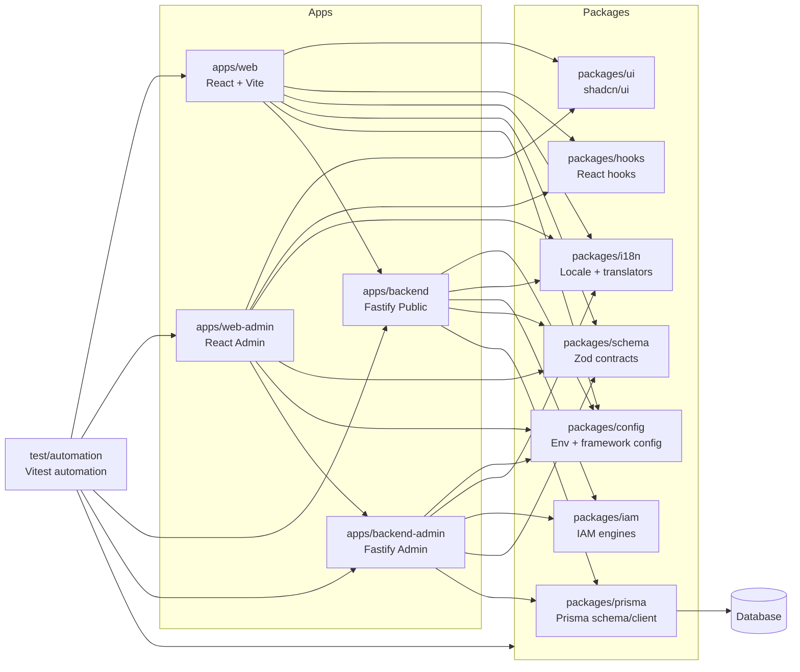

# Logical Architecture Diagram

本目录是 TETAP Agent Template 的逻辑架构设计中心。根 README 负责项目使用说明，本目录负责解释**为什么这样拆分、每个模块拥有什么、边界在哪里、如何扩展**。

## 推荐阅读顺序

1. [System Overview](00-system-overview.md)：系统目标、运行流、设计原则。
2. [Workspace Boundaries](01-workspace-boundaries.md)：workspace 依赖方向、ownership、禁止事项。
3. [Quality Gates](02-quality-gates.md)：检查、测试、构建、交付门禁。
4. 根据任务打开对应 app/package 设计文档。

## 总体架构图

## 文档索引

| 文档                                                     | 内容                                                       |
| -------------------------------------------------------- | ---------------------------------------------------------- |
| [00-system-overview.md](00-system-overview.md)           | 系统目标、运行时交互、设计原则、主要扩展场景。             |
| [01-workspace-boundaries.md](01-workspace-boundaries.md) | workspace ownership、依赖方向、允许/禁止边界。             |
| [02-quality-gates.md](02-quality-gates.md)               | lint、format、type-check、tests、build、release 门禁。     |
| [apps-web.md](apps-web.md)                               | React/Vite Web 应用架构与页面扩展规则。                    |
| [apps-web-admin.md](apps-web-admin.md)                   | 后台管理专用 React/Vite 应用和 admin page 归属规则。       |
| [apps-backend.md](apps-backend.md)                       | 公共 Fastify 后端分层、安全中间件、统一响应和 route 约束。 |
| [apps-backend-admin.md](apps-backend-admin.md)           | 后台管理专用 Fastify 服务和 admin API 归属规则。           |
| [packages-config.md](packages-config.md)                 | env、typed config、Vite/Node 入口设计。                    |
| [packages-hooks.md](packages-hooks.md)                   | hooks 集中仓库、form helper 和导出约束。                   |
| [packages-i18n.md](packages-i18n.md)                     | locale 资源、翻译核心、React/Node i18n。                   |
| [packages-iam.md](packages-iam.md)                       | IAM 权限、会话、策略、字段、数据和操作日志核心。           |
| [packages-prisma.md](packages-prisma.md)                 | Prisma schema 拆分、生成、数据库脚本和边界。               |
| [packages-schema.md](packages-schema.md)                 | Zod 契约、统一响应 schema、前后端交互模型。                |
| [packages-ui.md](packages-ui.md)                         | shadcn/ui 共享组件库和设计系统 runtime CSS。               |
| [test-automation.md](test-automation.md)                 | Vitest 单元、Browser Mode、冒烟和定向测试架构。            |

## 修改文档时的规则

- 修改某个 workspace 的职责时，同步更新根 [README.md](../../README.md)、[AGENTS.md](../../AGENTS.md) 和对应设计文档。
- 修改 package 导出、工具方法、service 方法、schema、Prisma model 或脚本时，同步更新对应 package README 的公开入口和方法说明。
- 新增 workspace 时，补充本文档索引、workspace boundaries、quality gates 中的相关说明。
- 新增约束时，优先放到根 README 的规则章节，再从 AGENTS.md 链接过去。
- 新增计划类工作时，必须同步 `docs/todolists` 的执行计划。
