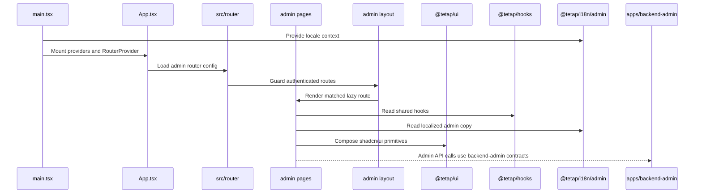

# apps/web-admin Architecture

## 定位

`apps/web-admin` 是后台管理专用浏览器应用，使用 React、Vite 和 React Router 负责后台管理页面 runtime、路由和页面组合。它与 `apps/backend-admin` 形成管理端前后端边界；公共用户页面仍属于 `apps/web`。管理端已包含控制台、设置、IAM 页面，用于展示用户/角色/权限码、前台在线会话、字段策略、动态策略和操作日志数据。

## 参考来源

- Reference repository: [satnaing/shadcn-admin](https://github.com/satnaing/shadcn-admin)
- Adopted patterns: authenticated layout shell, collapsible sidebar, profile dropdown, command search, auth pages, settings/theme controls, admin dashboard entry, navigation groups, KPI cards, tabs, and security/activity panel。
- Rejected patterns: app-local `components/ui`、app-local hooks、feature CSS、TanStack Router migration、direct dependency version drift。

## 职责

- 挂载 admin React app 和全局 providers。
- 定义 admin browser routes、受保护路由、auth routes 和页面级组合。
- 消费 `@tetap/ui`、`@tetap/hooks`、`@tetap/i18n/admin`、`@tetap/schema`、`@tetap/config`。
- 将后台管理接口调用集中指向 `apps/backend-admin` 的契约和 runtime。
- 展示后台管理页面，不沉淀跨项目 UI/样式系统。

## 服务边界

| Workspace            | Owns                                      | Must Not Own                                              |
| -------------------- | ----------------------------------------- | --------------------------------------------------------- |
| `apps/web`           | Public/user-facing browser app.           | Admin pages and admin-only workflows.                     |
| `apps/web-admin`     | Admin browser app and admin page runtime. | Public marketing/product pages or backend admin services. |
| `apps/backend-admin` | Admin management APIs.                    | Browser UI composition.                                   |

## 内部结构

| Path                     | Responsibility                                                                                                              |
| ------------------------ | --------------------------------------------------------------------------------------------------------------------------- |
| `src/main.tsx`           | React 挂载、`I18nProvider` 注入、`@tetap/ui/styles.css` 引入。                                                              |
| `src/App.tsx`            | App providers、document metadata side effects 和 `RouterProvider` 挂载。                                                    |
| `src/router/*`           | React Router 定义、route guards、route fallback UI 和 route-level lazy page declarations。                                  |
| `src/layout/*`           | shadcn-admin adapted layout shell、sidebar、header、search、profile 和 sign-out dialog。                                    |
| `src/pages/auth`         | 后台登录和 OTP 页面；后台账号只能由已授权管理员在用户管理中创建，schema 来自 `@tetap/schema`，session 来自 `@tetap/hooks`。 |
| `src/pages/iam.tsx`      | 用户、角色、权限码、菜单、字段权限、策略、前台在线用户和操作日志页面；所有数据来自 backend-admin。                          |
| `src/pages/settings.tsx` | 账号、外观、显示和通知设置页面，主题状态来自 `@tetap/hooks`。                                                               |
| `src/pages/*`            | Admin 页面组合；只拼装共享能力，不定义共享 primitives。                                                                     |
| `vite.config.ts`         | Vite 插件和 `@tetap/config/vite` env 目录配置。                                                                             |
| `tsconfig*.json`         | Admin web TypeScript 配置；`paths` 不依赖弃用的 `baseUrl`。                                                                 |

## 页面渲染流



## 允许

- 新增 admin 页面文件和 route 配置。
- 在 `src/router` 对页面级 route 继续使用 `React.lazy`/`Suspense`，避免 IAM 等管理页面重新进入入口 bundle。
- 保持 `App.tsx` 聚焦 provider/bootstrap，不把大量 route pages、guards 或 fallback components 堆在入口组件文件中。
- 从 `@tetap/ui` 组合已有 shadcn/ui 组件。
- 使用 `@tetap/hooks` 暴露的 hooks。
- 使用 `@tetap/schema` 做后台管理表单或 API contract 校验。
- 引入 `@tetap/ui/styles.css` 作为设计系统 runtime CSS。
- 使用 `@tetap/ui/sonner` toast 处理保存和错误反馈。
- 对 enum 字段使用 `Select`，对 role/menu/permission/department 等 ID 关联使用可搜索分页选择器。

## 禁止

- 创建 app-local `components/ui`、`components.json` 或本地 UI component system。
- 创建 app-local `hooks` 目录或 `use*.ts(x)` hook。
- 硬编码用户可见文案。
- 手写业务 CSS 文件、硬编码 utility class 或定制样式系统。
- 本地读取 `.env` 或绕过 `@tetap/config/vite`。
- 调用公共 `apps/backend` 实现后台管理接口；admin APIs 必须走 `apps/backend-admin`。
- 导入 public/backend i18n scope。
- 引入团队空间/工作区切换、升级专业版、计费或前台注册入口。

## 扩展步骤

1. 新增 admin 文案到 `@tetap/i18n/admin` scope 对应资源。
2. 如涉及接口，先在 `@tetap/schema` 定义 request/response contract。
3. 在 `apps/backend-admin` 增加对应 service/route。
4. 在 `apps/web-admin/src/pages` 组合 admin 页面。
5. 通过 `@tetap/ui` 增加或复用 shadcn/ui 组件。
6. 更新 Browser Mode UI 测试和 affected test mapping。
7. 运行 `pnpm test:browser:target -- web-admin-dashboard` 或 `pnpm test:affected`。

## 常用命令

```sh
pnpm --filter web-admin dev
pnpm --filter web-admin type-check
pnpm --filter web-admin lint
pnpm --filter web-admin build
pnpm test:browser:target -- web-admin-dashboard
```
