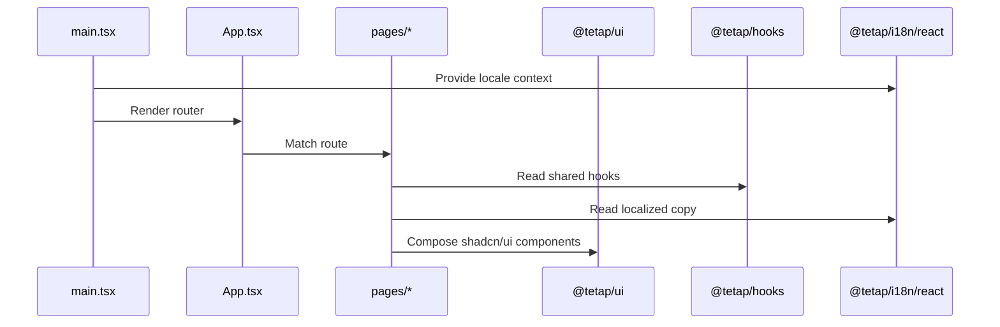

# apps/web Architecture

## 定位

`apps/web` 是浏览器应用层，使用 React、Vite 和 React Router 负责页面 runtime、路由和页面组合。它不拥有 UI primitive、i18n 资源、schema 定义、env 策略或 custom hooks。

## 职责

- 挂载 React app 和全局 providers。
- 定义浏览器路由和页面级组合。
- 消费 `@tetap/ui`、`@tetap/hooks`、`@tetap/i18n`、`@tetap/schema`、`@tetap/config`。
- 展示业务页面，不沉淀跨项目 UI/样式系统。

## 内部结构

| Path             | Responsibility                                                 |
| ---------------- | -------------------------------------------------------------- |
| `src/main.tsx`   | React 挂载、`I18nProvider` 注入、`@tetap/ui/styles.css` 引入。 |
| `src/App.tsx`    | React Router 和 app shell 级组合。                             |
| `src/pages/*`    | 页面组合；只拼装共享能力，不定义共享 primitives。              |
| `vite.config.ts` | Vite 插件和 `@tetap/config/vite` env 目录配置。                |
| `tsconfig*.json` | Web TypeScript 配置；`paths` 不依赖弃用的 `baseUrl`。          |

## 页面渲染流



## 允许

- 新增页面文件和 route 配置。
- 从 `@tetap/ui` 组合已有 shadcn/ui 组件。
- 使用 `@tetap/hooks` 暴露的 hooks。
- 使用 `@tetap/schema` 做表单或 API contract 校验。
- 引入 `@tetap/ui/styles.css` 作为设计系统 runtime CSS。

## 禁止

- 创建 app-local `components/ui`、`components.json` 或本地 UI component system。
- 创建 app-local `hooks` 目录或 `use*.ts(x)` hook。
- 硬编码用户可见文案。
- 手写业务 CSS 文件、硬编码 utility class 或定制样式系统。
- 本地读取 `.env` 或绕过 `@tetap/config/vite`。

## 扩展步骤

1. 新增文案到 `@tetap/i18n`。
2. 新增或更新 route/page。
3. 通过 `@tetap/ui` 组合界面。
4. 如需要表单，使用 `@tetap/schema` 和 `@tetap/hooks/form`。
5. 更新 Browser Mode UI 测试和 affected test mapping。
6. 运行 `pnpm test:browser:target -- <target>` 或 `pnpm test:affected`。

## 常用命令

```sh
pnpm --filter web dev
pnpm --filter web type-check
pnpm --filter web lint
pnpm --filter web build
pnpm test:browser
```
