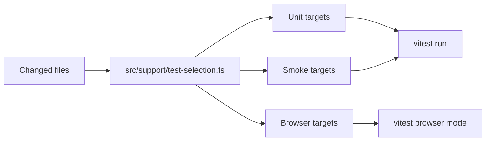

# test/automation Architecture

## 定位

`@tetap/test-automation` 是集中自动化测试 workspace，负责 Vitest 单元测试、Vitest Browser Mode UI 功能测试、smoke tests、targeted tests 和 affected test selection。

## 测试类型

| Type     | Location                            | Purpose                                                 |
| -------- | ----------------------------------- | ------------------------------------------------------- |
| Unit     | `src/unit/**/*.unit.test.ts`        | 验证 config、schema、selector、helper 等纯逻辑。        |
| Browser  | `src/browser/**/*.browser.test.tsx` | 使用真实浏览器验证 UI 组件、admin web 页面和交互。      |
| Smoke    | `src/smoke/**/*.smoke.test.ts`      | 验证 backend app boot、critical API flow 和统一响应体。 |
| Targeted | `scripts/run-targeted-tests.ts`     | 按 type/target/name/changed files 只运行受影响测试。    |

## 内部结构

| Path                            | Responsibility                                           |
| ------------------------------- | -------------------------------------------------------- |
| `vitest.config.ts`              | Node/unit/smoke config，使用源码 alias 避免 stale dist。 |
| `vitest.browser.config.ts`      | Browser Mode config，Playwright provider，React plugin。 |
| `src/support/test-selection.ts` | target 列表和 changed-file impact map。                  |
| `scripts/run-targeted-tests.ts` | CLI runner：target、affected、name pattern。             |
| `SMOKE_TEST_DESIGN.md`          | 冒烟测试覆盖设计。                                       |

## 命令

```sh
pnpm test
pnpm test:unit
pnpm test:browser
pnpm test:smoke
pnpm test:affected
pnpm test:target -- unit schema-response
pnpm test:target -- unit schema-response --name healthResponseSchema
pnpm test:unit:target -- i18n-site
pnpm test:unit:target -- iam-engine
pnpm test:unit:target -- backend-security
pnpm test:browser:target -- ui-components
pnpm test:browser:target -- web-admin-dashboard
pnpm test:smoke:target -- backend-health
pnpm test:smoke:target -- backend-admin-iam
```

## Affected Test Flow



## Current Impact Highlights

- `packages/schema/**` selects schema unit tests, IAM engine unit tests, public health smoke, and admin IAM smoke.
- `packages/iam/**` selects IAM engine unit tests and admin IAM smoke.
- `apps/backend/**` selects backend security unit tests and public health smoke.
- `apps/backend-admin/**` selects backend security unit tests plus admin health and IAM smoke.
- `apps/web-admin/**` selects the admin Browser Mode dashboard/IAM coverage.

## 规则

- 自动化测试统一使用 Vitest。
- UI 功能测试必须使用 Vitest Browser Mode，不用 jsdom 替代关键浏览器交互。
- Smoke tests 需要验证 runtime boot、HTTP status、content-language、统一响应体和 schema。
- 测试断言用户文案时优先从 `@tetap/i18n` 或实际 API output 获取。
- 新增模块、测试 target 或影响关系时更新 `src/support/test-selection.ts`。
- `@tetap/test-automation#build` 运行 `pnpm test:smoke`，作为 root build smoke gate。
